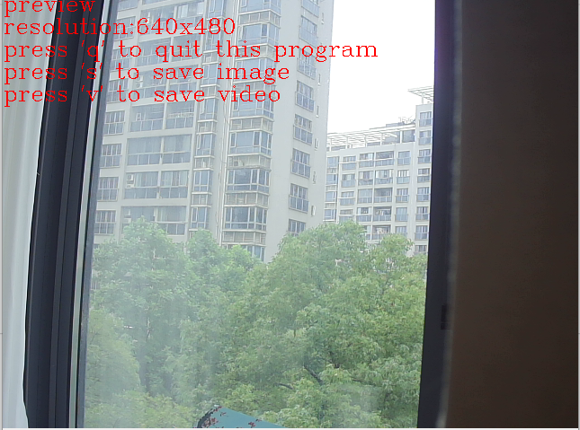

# 一些Python常用的代码片段

## video模块
1. 录像
可以使用video/VideoRecorder.py进行摄像头/视频图像截取或者录像.
运行一下命令打开摄像头:
```python
python video/VideoRecorder.py -d /dev/video0 -t . -r "640x480"
```
可以看到以下画面：



命令中```-d```指定摄像头或者视频，```-t```指定视频或者图片保存位置，```-r```指定打开摄像头的分辨率。
程序运行窗口中，按键```'q'```退出程序，按键```'s'```保存图片，　按键```'v'```保存视频。
